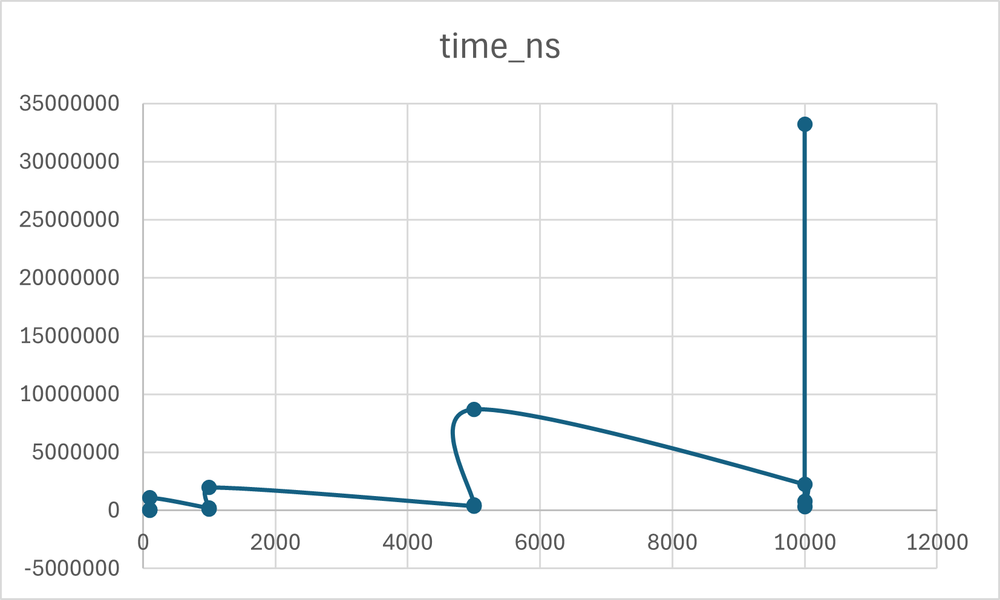
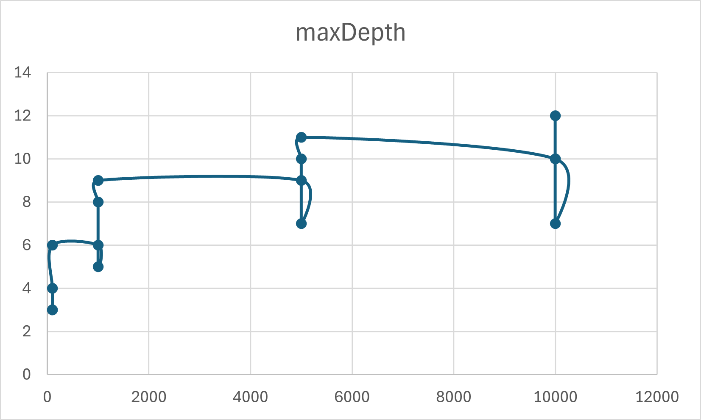

# Assignment 1 — Divide and Conquer Algorithms

## Implemented Algorithms
- **MergeSort**  
  Linear merge with reusable buffer, cutoff to insertion sort.  
  Recurrence: T(n) = 2T(n/2) + Θ(n) → Θ(n log n).

- **QuickSort**  
  Randomized pivot, recursion into smaller part, iteration into larger.  
  Recurrence (avg.): T(n) = T(pn) + T((1-p)n) + Θ(n) → Θ(n log n).

- **Deterministic Select (Median of Medians)**  
  Groups of 5, median of medians as pivot, in-place partition.  
  Recurrence: T(n) = T(n/5) + T(7n/10) + Θ(n) → Θ(n).

- **Closest Pair of Points**  
  Divide and conquer with strip check (7–8 neighbors).  
  Recurrence: T(n) = 2T(n/2) + Θ(n) → Θ(n log n).

---

## Metrics
- **Execution time (ns)**
- **Recursion depth**

Saved to `metrics.csv` in format:
## Results

### Time vs Input Size

### Depth vs Input Size

